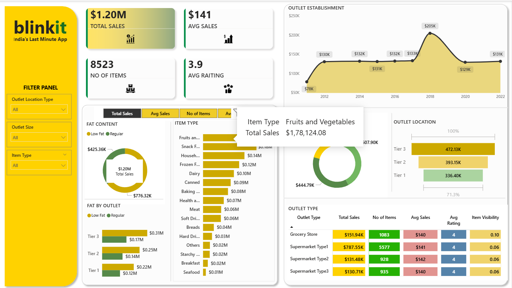

# 🛒 Blinkit Sales & Performance Dashboard

## 📊 Project Overview
An interactive Power BI dashboard analyzing Blinkit's sales performance, 
outlet distribution, and product-level metrics to derive actionable business insights.

## 🎯 Objective
To help stakeholders quickly understand sales trends, outlet performance, 
and product category contributions using visual, filterable reports.

## 📌 Key Features
- **KPI Cards** — Total Sales, Average Sales, Items Count, Average Rating
- **Slicer Filters** — Filter by outlet size, location tier, fat content, item type
- **Visuals** — Bar charts, Donut charts, Line charts, Matrix table
- **DAX Measures** — Custom calculations for aggregated KPIs

## 🛠️ Tools Used
| Tool | Purpose |
|------|---------|
| Power BI Desktop | Dashboard development |
| DAX | Custom measures & calculations |
| Power Query | Data cleaning & transformation |
| Excel/CSV | Raw data source |

## 📷 Dashboard Preview

## 📁 Files
| File | Description |
|------|-------------|
| `blinkit_Dashboard_VISUAL_.pbix` | Main Power BI file |
| `BlinkIT Grocery Data.xlsx` | Raw dataset used for analysis |

## 🔍 Insights Derived
- Identified top-performing outlet types by total sales
- Compared sales across Tier 1, 2, and 3 locations
- Analyzed fat content impact on sales performance
- Tracked outlet establishment trends over time
